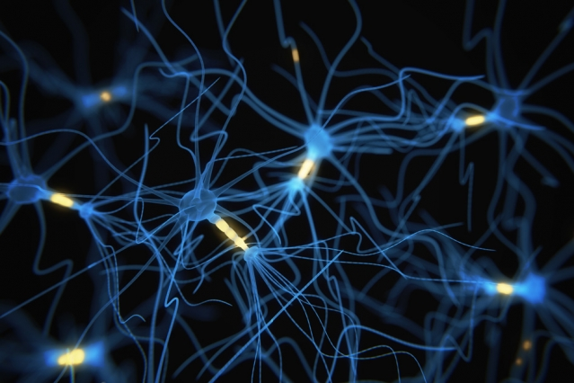

## 1. Motivation behind Neural Networks

### 1.1 Non-linear Hypothesis
In the previous weeks, we covered two powerful tools for modeling - linear and logistic regression.

We saw that if our hypothesis of the underlying relationship between the features and 
the target variable is non-linear then we can add quadratic terms to increase flexibility.

This approach works when our feature space consists of a small number of variables. 
However, in practise, we will end up working with hundreds and hundreds of input variables.

Taking even just the quadratic and cubic terms increases the number of features
 to a level where overfitting is likely to occur as well as the computation becomes too expensive.

This is especially the case when we try to solve computer vision challenges since the number of pixels
(inputs) are large.

Neural Networks are a solution to this problem. They can learn a complex non-linear hypothesis even
when the feature space is large.

### 1.2 Neurons and the Brain
Neural Networks attempt to mimic the structure of our brain. They were quite popular 
in the 1980s and 90s and came back to fashion in recent years. The reason behind this
is that training NNs can be computationally expensive and it's not until recently 
that computers became fast enough to run large scale Neural Networks.

Many neuroscience experiments point towards the idea that there exists one 'ultimate' **brain
learning algorithm**. For instance, if we rewire our vision sensor into the tissue that
is responsible for processing sound, it learns how to visualize.

The hope is to one day implement this algorithm or some approximation of it.
 That is when we start to build truly intelligent systems.

## 2. Neural Networks - Model Representation

### 2.1 The structure of a Biological Neuron

Our brain is made up of about a 100 billion neurons. Below a simplistic model of a neuron is shown.

>The **Cell Body (Soma)** receives electrical inputs through the **Dentrites**. It 
performs some hidden computations and channels its output to the **Axon**.

The process above could sound abstractly familiar.

*There is an input. Some wrangling is performed
and we have an output.* 

At a first glance, it looks like a function. However, for that to be true,
each input has to be associated with a unique output. That I can't confirm, nor deny.

As I mentioned earlier, there are about 100 billion of these nodes and they get their inputs
from each others' outputs. Wired!

### 2.2 The Structure of an Artificial Neuron

#### 2.2.1 Neuron

An artificial neuron is a function. 
 
 
 
 * The **inputs** of this neuron are the features $x_1, x_2$ and $x_3$. We always have an additional feature
 $x_0$ (not indicated on the picture) called the **bias**. The bias always has the value 1.
 These are stored in the column vector $\bm{x}$.
 * Each input is associated with a **weight** $w_i$ including the bias (with $w_0$). To be consistent with
 the notation that follows, call these $\theta_i$ and store it in the column vector $\bm{\theta}$.
 * The computation inside the neuron takes the sum of the elementwise products of the features and 
 weights. This sum is called $z$.
 
 $$\sum_{i=0}^{3} \theta_ix_i = \begin{bmatrix}\theta_0 &\theta_1&\theta_2 &\theta_3\end{bmatrix}\cdot \begin{bmatrix} x_0 \\x_1 \\x_2 \\x_3 \end{bmatrix}= \bm{\theta}^T\bm{x} = z$$
 
* $z$ is fed in as an input for some **activation function $\sigma$** (for example Sigmoid), resulting in 

$$\sigma(z)=\frac{1}{1+e^{-z}}=y$$

### 2.2.2 A Network of Neurons

A Neural Network is a system consisting of multiple nodes/ neurons connected by weights. The nodes are 
organised in layers and the layers are grouped into three different categories -
input, hidden and output. Every layer between the input and the output is hidden.

Here is an example of a Neural Network with three layers - the input layer, one hidden layer,
and the output layer.

Now define **activation unit** $a_i^{(j)}$ to be neuron $i$ in layer $j$. The input layer is labelled
with $j=0$. The column vector $\bm{a^{(j)}}$ contains all activation units in layer $j$.

Next, define $\theta_{ik}^{(j)}$ to be the weight from unit $k$ in layer $j$ to unit $i$ in layer $j+1$.
The column vector $\bm{\theta^{(j)}}$ contains all weights from layer $j$ to layer $j+1$, 

with 
$$[\bm{\theta^{(j)}}]_{i\times k}= \theta_{ik}^{(j)}$$. 

### 2.3 Forward Propagation

Using the notation above, $a_i^{(j)} = \sigma(z_i^{(j)})$ where $z_i^{(j)}=\sum_{k=0}^{n} \theta_{ik}^{(j-1)}a_k^{(j-1)}$.
Define $\bm{z^{(j)}}$ to be the column vector containing all $z_i^{(j)}$ in layer $j$.

In the vectorized implementation, knowing $\bm{a^{(j)}}$ and $\bm{\theta^{(j)}}$ yields $\bm{z^{(j+1)}}$.
Applying $\sigma$ to $\bm{z^{(j+1)}}$ elementwise gives the vector of activations in layer $j+1$, 
$\bm{a^{(j+1)}}$.

$$ \bm{a^{(j+1)}}= \sigma(\bm{\theta^{(j)}}\bm{a^{(j)}}) $$

This process of calculating the activations layer by layer using matrix operations is called **Forward 
Propagation**. 

### 2.4 Complex Non-Linear Hypothesis

Take a look at the calculations to get the last layer from the previous layer in a Neural Network with 
N layers.

$$ h_{\theta}(\bm{x})= \bm{a^{(N)}}= \sigma(\bm{\theta^{(N-1)}}\bm{a^{(N-1)}}) = \sigma(\bm{z^{(N)}})$$

Therefore in the last step we do exactly the same steps as in logistic regression. The power of Neural
Networks over Logistic Regression lays in the activation units that are fed in as inputs to this calculation.

In the steps preceding we learn the right combination of features in $\bm{x}$ to satisfy the sought complex 
non-linear hypothesis. In Logistic Regression we could add more non-linear features but the training of the model
becomes computationally expensive and hence infeasible. 

 
 
 
 

