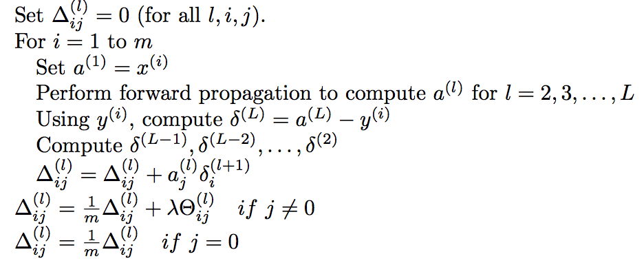

This lesson is going to cover how to train your neural network using a technique called backpropagation,
which is a learning algorithm for fitting the parameters (weights) of your Neural Network.
# 1. Cost Function and Backpropagation

### 1.1 Cost Function

From the previous lessons we know that the cost function measures the discrepancy between our predictions 
and labels for the training data with respect to some chosen metric $d$. That means we account for this discrepancy 
for all training pairs, summing up $d(\bm{y^{(i)}}, h_{\theta}(\bm{x^{(i)}}))$ for all $ i=1,2,3,...,m $
(where m is the number of training examples). 

In logistic regression when we perform binary classification the metric is defined to be the following: 

$d(\bm{y^{(i)}}, h_{\theta}(\bm{x^{(i)}}))=
[-\bm{y^{(i)}}log(h_{\theta}(\bm{x^{(i)}}))-(1-\bm{y^{(i)}})log(1-h_{\theta}(\bm{x^{(i)}}))]$

The cost function sums up this distance for each training example and regularizes all non-bias weights 
to avoid overfitting:

$J(\bm{\theta})=\frac{1}{m}\sum_{i=1}^{m}{d(\bm{y^{(i)}}, h_{\theta}(\bm{x^{(i)}}))}
+\frac{\lambda}{2m}\sum_{j=1}^{n}{\theta_j^2}$

At a K multi-class classification, we employ K binary classifiers and sum up the cost through all K of them.

The cost function of a Neural Network is a generalization of the logistic regressions. Each node
in the output layer performs a binary classification similarly to logistic regression
with an output between $0$ and $1$. 

Therefore for a Neural Network with
* $m$ training examples
* $L$ layers
* $s_l$ units (excluding bias) in layer $l$
* $K$ classes 

$d_k(\bm{y^{(i)}}_k, h_{\theta}(\bm{x^{(i)}}_k))=
[-\bm{y_k^{(i)}}log(h_{\theta}(\bm{x^{(i)}}))_k-(1-\bm{y_k^{(i)}})log(1-h_{\theta}(\bm{x^{(i)}}))_k]$

and

$J(\bm{\theta})=\frac{1}{m}\sum_{i=1}^{m}\sum_{k=1}^{K}{d_k(\bm{y^{(i)}}_k, h_{\theta}(\bm{x^{(i)}}_k))}
+\frac{\lambda}{2m}\sum_{l=1}^{L}\sum_{i=1}^{s_l}\sum_{j=1}^{s_{l+1}}{(\theta_{j,i}^{(l)})^2}$

The distance between the predictions and the actual labels is summed up through all $K$ classes for all 
$m$ training examples. Regularization terms are added for all weights between the nodes 
(excluding the bias units). 

Now that the Cost Function is defined, the next task is to minimize its value in order to find the weights
yielding the most accurate predictions.

### 1.2 Backpropagation Algorithm

Backpropagation is the name of the algorithm that we use to minimize a Neural Network's Cost Function. 
Therefore we try to find the value of each $\theta_{j,i}^{(l)}$ that minimizes $J(\bm{\theta})$. For that we need to 
calculate the partial derivatives of $J(\bm{\theta})$ with respect to each parameter. A vector
formed by the partial derivatives at each parameter is the gradient. The negative of the gradient will guide 
us towards the steepest downhill and hence the minimum of the cost function.

Let's look at how does backpropagation looks like with one training example $(\bm{x},\bm{y})$ on a 
Neural Network with four layers.

**Forward Propagation**
 
First we would calculate the output of each node in the last layer by forward propagating.

$\bm{a^{(1)}} = \bm{x}$
 
$\bm{z^{(2)}} = \bm{\theta^{(1)}} \bm{a^{(1)}}$ 
 
$\bm{a^{(2)}} = g(\bm{z^{(2)}})$ &nbsp;&nbsp;&nbsp;&nbsp; add $a_0^{(2)}$ (_bias term_)
 
$\bm{z^{(3)}} = \bm{\theta^{(2)}} \bm{a^{(2)}}$
 
$\bm{a^{(3)}} = g(\bm{z^{(3)}})$ &nbsp;&nbsp;&nbsp;&nbsp; add $a_0^{(3)}$ (_bias term_)
 
$\bm{z^{(4)}} = \bm{\theta^{(3)}} \bm{a^{(3)}}$
 
$\bm{a^{(4)}} = g(\bm{z^{(4)}})$ 

**Backpropagation**
 
Secondly we calculate the partial derivatives. We start by defining $\delta_j^{(l)}$ as the "*error*"
of node $j$ in layer $l$. 

$\bm{\delta^{(4)}} = \bm{a^{(4)}} - \bm{y}$
 
$\bm{\delta^{(3)}} = (\bm{\theta^{(3)}})^T \bm{\delta^{(4)}} * g'(\bm{z^{(3)}})$
 
$\bm{\delta^{(2)}} = (\bm{\theta^{(2)}})^T \bm{\delta^{(3)}} * g'(\bm{z^{(2)}})$

The $*$ operator stands for elementwise multiplication and $g'$ is the derivative of 
the activation function.

The partial derivative of $J(\theta)$ with respect to $\theta_{i,j}^{(l)}$ without regularization is:

$  \frac {\partial}{\partial \theta_{i,j}^{(l)}} J(\theta) = a_j^{(l)} \delta_i^{(l+1)}$

For more training examples the algorithm is summarized below:

